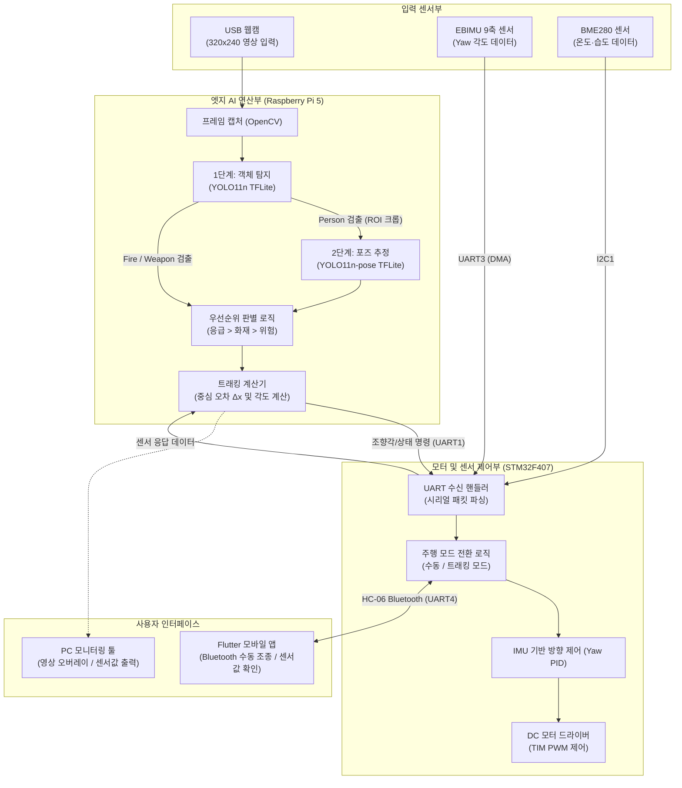
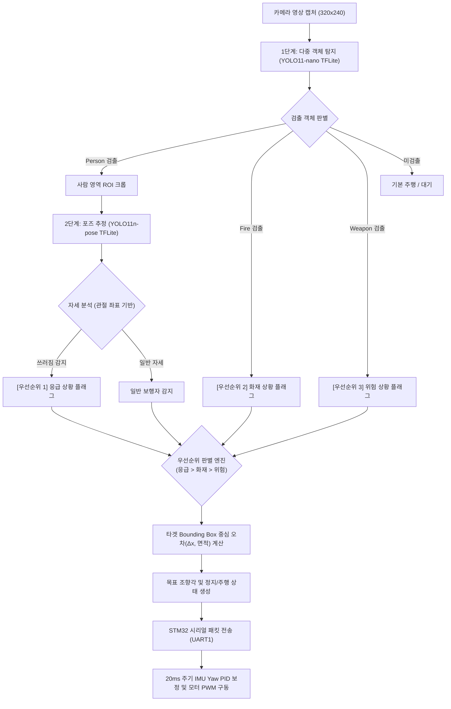
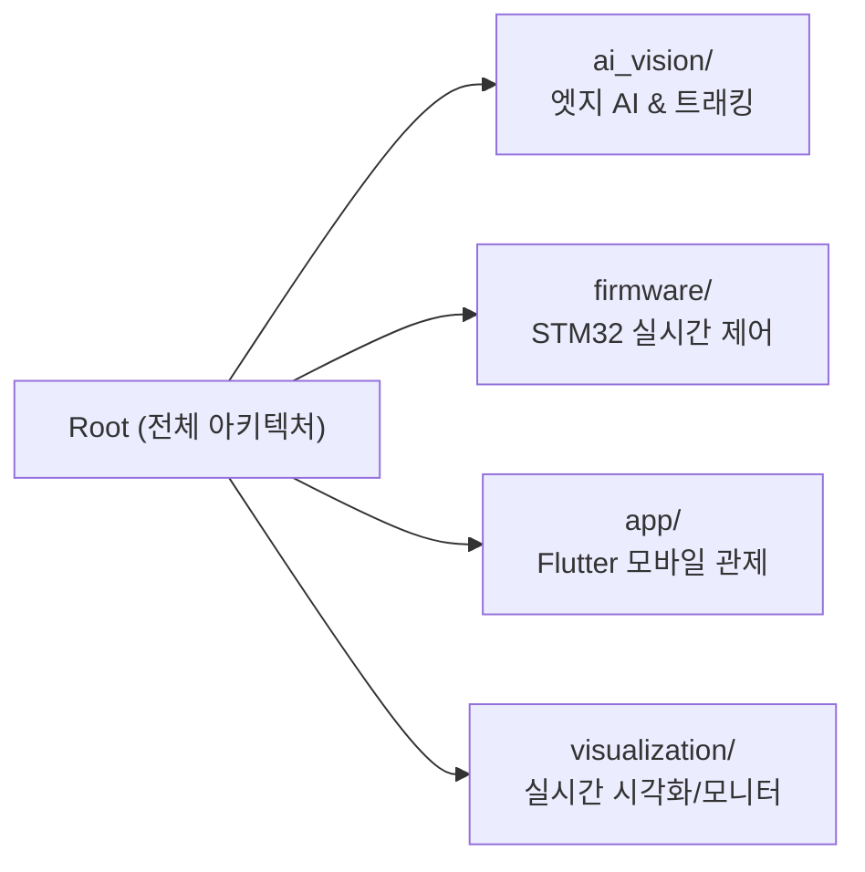

# 🤖 온디바이스 AI 기반 트래킹 순찰 로봇<br>(Tracking Patrol Robot)

> **라즈베리파이 5(Edge AI)와 STM32F407을 결합한 실시간 이상 징후 감지 및 다중 객체 우선순위 자율 추적 순찰 로봇**

---

## 📌 1. 프로젝트 개요 (Project Overview)

본 프로젝트는 고비용 서버나 클라우드 인프라와의 상시 연결 없이, 로봇 단말 자체의 **Raspberry Pi 5**와 **STM32F407VET6 임베디드 제어기**만으로 구동되는 **독립형 온디바이스 AI 순찰 로봇**입니다.

보안 및 안전 관리가 필요한 실내외 환경에서 자율 순찰을 수행하며, 비전 카메라와 센서 데이터를 결합하여 **흉기/위험 인물(Weapon), 쓰러짐/응급 환자(Emergency Person), 화재(Fire)** 등 이상 상황을 실시간으로 감지하고 우선순위에 따라 현장 타겟을 능동 추적(Tracking)합니다.

### 🎯 핵심 목표 및 특징
- **100% 온디바이스 엣지 연산**: 네트워크 단절 환경에서도 라즈베리파이 5 상에서 양자화 모델(INT8 TFLite)을 구동하여 15~20+ FPS 추론 보장
- **2단계(Two-Stage) ROI 최적화**: 1단계 객체 검출 후 '사람' 영역만 크롭하여 11개 커스텀 관절 포즈를 연산함으로써 불필요한 연산 부하 최소화
- **상황 판단 및 우선순위 추적 엔진**: `응급(쓰러짐) > 화재(불꽃) > 위험(흉기)`의 결정 규칙 기반 타겟 자동 선정 및 조향 오차각 출력
- **고신뢰성 실시간 제어 아키텍처**: TIM4 20ms 주기 인터럽트 기반 IMU Yaw 각도 추종 PID 제어, 비동기 시리얼 패킷 처리를 통한 신뢰성 확보

---

- **시연 영상**:<br>
  [](https://www.youtube.com/watch?v=0Xhue5Aivyg)

---

## 🏗️ 2. 전체 시스템 아키텍처 (System Architecture)

전체 시스템은 센서 데이터 입력부, 고성능 엣지 AI 추론부(Raspberry Pi 5), 실시간 모터/센서 제어부(STM32F407VET6), 사용자 관제 인터페이스로 유기적으로 연결되어 있습니다.



---

## 🔄 3. 상황 판단 및 우선순위 트래킹 흐름도 (Priority & Control Flow)

카메라 입력으로부터 객체 탐지, 자세 분석, 우선순위 판별, 모터 제어에 이르는 전체 데이터 파이프라인 흐름입니다.



---

## 🧩 4. 파트별 서브시스템 요약 (Subsystem Overview)

> 각 파트의 세부 구현 내용, 소스 코드 분석, 환경 설정 및 상세 실행 방법은 각 디렉토리 내부의 `README.md`에 기술되어 있습니다.



### 1) [AI Vision & Tracking Subsystem (`ai_vision/`)](./ai_vision/README.md)
- **주요 역할**: 엣지 디바이스(라즈베리파이 5) 상에서의 실시간 영상 취득, 경량 딥러닝 추론, 우선순위 타겟 트래킹 알고리즘 연산
- **핵심 기술**:
  - 1단계 YOLO11-nano 객체 검출 + 2단계 11 Keypoints 포즈 추정 기반 Two-Stage ROI 파이프라인
  - TFLite INT8 Full Integer Quantization 및 Frame Buffer=1 적용을 통한 고속 추론 달성
  - 타겟 중심 오차 기반 조향 각도 및 동작 상태 플래그 산출
- 📖 **상세 내용**: [`ai_vision/README.md`](./ai_vision/README.md) 참조

### 2) [Embedded Firmware Subsystem (`firmware/`)](./firmware/README.md)
- **주요 역할**: STM32F407VET6 마이크로컨트롤러 기반의 실시간 하드웨어 구동, 센서 융합 및 주행 제어
- **핵심 기술**:
  - TIM4 20ms 주기 인터럽트 기반 IMU Yaw 자세각 추종 PID 모터 제어
  - 블루투스(UART4) 연동을 통한 수동 조종/트래킹 주행 모드 분기 및 런타임 PID 게인 업데이트
  - BME280(I2C) 이동평균/저역통과 필터 및 EBIMU(UART3 DMA) 상보필터 데이터 처리
- 📖 **상세 내용**: [`firmware/README.md`](./firmware/README.md) 참조

### 3) [Mobile Application Subsystem (`app/`)](./app/README.md)
- **주요 역할**: 관리자용 Android 모바일 원격 관제 및 대시보드 인터페이스
- **핵심 기술**:
  - Flutter 기반 크로스 플랫폼 애플리케이션 개발
  - Bluetooth Classic (HC-06) 통신을 통한 무선 상태 텔레메트리 수신 및 수동 조이스틱 조종
  - PID 게인 값 수동 설정 및 실시간 전송
- 📖 **상세 내용**: [`app/README.md`](./app/README.md) 참조

### 4) [Visualization & Telemetry Subsystem (`visualization/`)](./visualization/README.md)
- **주요 역할**: PC 기반 실시간 비전 인식 결과 오버레이 뷰어 및 센서 텔레메트리 시각화 툴
- **핵심 기술**:
  - OpenCV 기반 영상 스트림 위 Bounding Box, 11개 Pose 스켈레톤, 추적 벡터 실시간 오버레이 (`monitor.py`)
  - IMU Roll/Pitch/Yaw 자세각 및 BME280 환경 데이터 실시간 그래프 플롯 (`sensor_monitor.py`)

---

## 🛠️ 5. 핵심 하드웨어 구성 (Hardware Specifications)

| 구분 | 주요 부품 | 사양 및 주요 역할 | 인터페이스 |
| :--- | :--- | :--- | :---: |
| **Edge AI Processor** | **Raspberry Pi 5 (4GB)** | On-Device AI 딥러닝 추론, 영상 처리 및 트래킹 제어량 계산 | - |
| **MCU Controller** | **STM32F407VET6** | ARM Cortex-M4 실시간 모터 제어 및 센서 융합 | UART / I2C / TIM |
| **비전 카메라** | **USB Webcam** | 320×240 저지연 실시간 순찰 영상 캡처 | USB 2.0 (V4L2) |
| **자세 센서 (IMU)** | **EBIMU-9DOFV5** | 9축 센서(가속도·자이로·지자기), Yaw 각도 데이터 취득 | USART3 (DMA) |
| **환경 센서** | **BME280** | 온도, 습도 측정 (이상 환경 모니터링) | I2C1 |
| **무선 통신** | **HC-06 Bluetooth** | 모바일 앱과 STM32 펌웨어 간 양방향 시리얼 데이터 전송 | UART4 |
| **구동 모터** | **DC Geared Motors** | 차동 구동 플랫폼, 모터 구동 및 방향 제어 | TIM2 PWM / GPIOC |

---

## 📂 6. 프로젝트 디렉토리 구조 (Directory Structure)

```
Tracking_Patrol_Robot/
├── .gitignore
├── README.md                      # 최상위 프로젝트 통합 문서 (본 파일)
│
├── ai_vision/                     # [파트 1] 엣지 AI 비전 및 트래킹 파이프라인
│   ├── README.md                  # ai_vision 세부 가이드 및 모델 성능 문서
│   ├── capture/
│   │   └── cap_video.py           # 카메라 영상 수신 및 전처리 모듈
│   ├── models/                    # 경량화 딥러닝 모델 저장소
│   │   ├── model_full_integer_quant.tflite        # Stage 1 INT8 검출 모델
│   │   └── yolo11n-pose_full_integer_quant.tflite # Stage 2 INT8 11-포즈 모델
│   ├── test/
│   │   └── test_tracking.py       # 트래킹 알고리즘 단위 테스트
│   ├── tracking_robot_11point.py  # 11개 키포인트 기반 종합 추론/트래킹 메인
│   └── tracking_robot_custom.py   # 커스텀 우선순위 트래킹 로직
│
├── firmware/                      # [파트 2] STM32F407VET6 실시간 임베디드 펌웨어
│   ├── README.md                  # firmware 세부 구조, 핀맵, 빌드 가이드
│   ├── firmware.ioc               # STM32CubeMX 하드웨어 구성 파일
│   └── Core/
│       ├── Inc/                   # 펌웨어 드라이버 헤더 (motor, imu, bme280, blt, mode 등)
│       └── Src/                   # 펌웨어 소스 구현체
│
├── app/                           # [파트 3] Flutter Android 모바일 관제 앱
│   ├── README.md                  # 모바일 앱 세부 기능, 화면 구성, 빌드 가이드
│   ├── pubspec.yaml               # Flutter 패키지 의존성 설정
│   └── lib/
│       └── main.dart              # 모바일 앱 메인 UI 및 블루투스 연동 코드
│
└── visualization/                 # [파트 4] 실시간 시각화 및 모니터링 도구
    ├── README.md                  # 모니터링 도구 세부 실행 옵션 가이드
    ├── monitor.py                 # 비전 인식 오버레이 뷰어
    └── sensor_monitor.py          # IMU 및 환경 센서 실시간 그래프 플로터
```

---

## 👥 7. 팀 구성 및 역할 (Team Organization)

- **소속**: AI 융합 로봇 전문 인력 양성 과정 3기 (온디바이스 AI 2조)
- **팀원**:
  - **이명욱 (팀장)**: 전체 시스템 아키텍처 설계, STM32 펌웨어 및 통신 인터페이스 개발, Flutter Android 모바일 관제 앱 개발
  - **황은하**: AI 모델 학습(YOLO11), 11-Keypoint Pose 데이터셋 구축, TFLite INT8 양자화
  - **안재권**: 펌웨어 Bluetooth 제어 인터페이스 구현, PID 모터 제어
  - **김지우**: 센서 데이터 전처리, IMU/BME280 융합 필터링, Python 모니터링 시각화 도구 개발