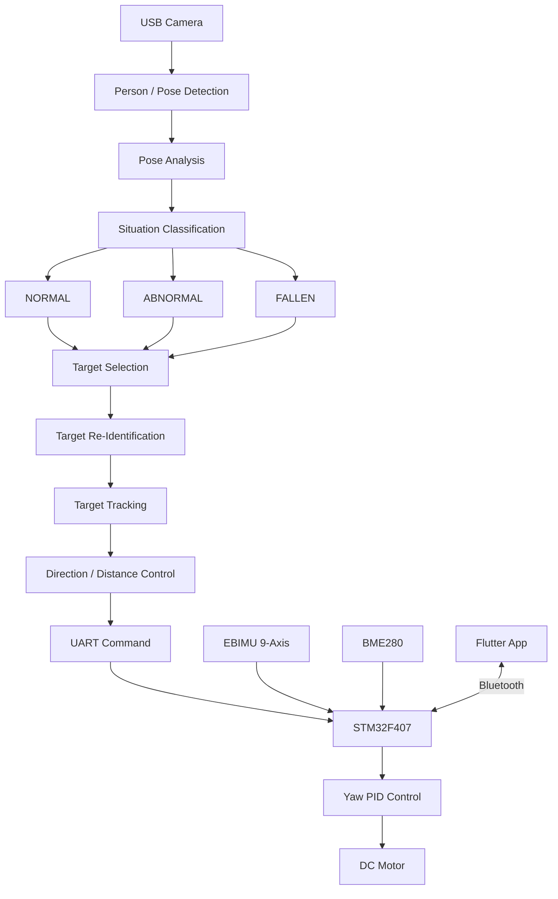
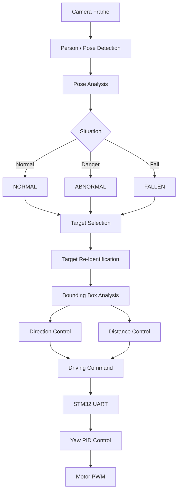

# 🤖 Tracking Patrol Robot

## 온디바이스 AI 기반 트래킹 순찰 로봇

> Raspberry Pi 5와 STM32F407을 기반으로 Pose 상황 판단, 대상 추적 및 재식별 기능을 구현한 순찰 로봇

Raspberry Pi 5에서 사람 및 Pose 인식 결과를 이용해 상황을 판단하고 추적 대상을 선정하며,  
STM32 기반 주행 제어와 모바일 수동 제어 및 모니터링 기능을 연동한 4인 팀 프로젝트입니다.

---

## 1. Project Overview

본 프로젝트는 Raspberry Pi 5에서 사람 및 Pose 인식 결과를 이용하여  
대상의 상태를 판단하고, 선택된 대상을 지속적으로 추적하는 순찰 로봇입니다.

### Situation Classification

사람의 Pose 정보를 이용하여 다음 3가지 상황을 판단합니다.

| State | Description |
| --- | --- |
| NORMAL | 일반적인 자세의 사람 |
| ABNORMAL | 위험 행동 또는 위험 상황으로 판단된 사람 |
| FALLEN | 낙상 상태로 판단된 사람 |

Pose의 팔, 어깨, 다리 각도 등을 이용하여 위험 및 낙상 의심 상황을 판단하고  
상황에 따라 추적 대상을 선택합니다.

> 초기 개발 과정에서 화재 감지를 검토했으나 실제 시험을 완료하지 못해 최종 프로젝트 범위에서는 제외했습니다.

---

## 🎬 Demo

[](https://www.youtube.com/watch?v=0Xhue5Aivyg)

---

## 2. Key Features

- Raspberry Pi 5 기반 On-Device AI
- YOLO 기반 사람 객체 탐지
- Pose 기반 사람 자세 분석
- NORMAL / ABNORMAL / FALLEN 상황 판단
- 상황에 따른 추적 대상 선정
- Bounding Box 기반 방향 및 거리 제어
- 색상 히스토그램 기반 대상 재식별
- Raspberry Pi → STM32 주행 명령 전달
- STM32F407 기반 모터 및 센서 제어
- IMU Yaw 기반 PID 방향 제어
- Flutter 기반 모바일 수동 제어
- 모바일 PID Gain 설정 및 저장
- Flask 기반 카메라 영상 확인

---

## 3. System Architecture


```mermaid
flowchart TD
    CAM["USB Camera"] --> AI["Person / Pose Detection"]

    AI --> POSE["Pose Analysis"]
    POSE --> STATE["Situation Classification"]

    STATE --> NORMAL["NORMAL"]
    STATE --> ABNORMAL["ABNORMAL"]
    STATE --> FALLEN["FALLEN"]

    NORMAL --> TARGET["Target Selection"]
    ABNORMAL --> TARGET
    FALLEN --> TARGET

    TARGET --> REID["Target Re-Identification"]
    REID --> TRACK["Target Tracking"]

    TRACK --> CTRL["Direction / Distance Control"]
    CTRL --> UART["UART Command"]
    UART --> STM["STM32F407"]

    IMU["EBIMU 9-Axis"] --> STM
    BME["BME280"] --> STM

    STM --> PID["Yaw PID Control"]
    PID --> MOTOR["DC Motor"]

    APP["Flutter App"] <-->|Bluetooth| STM
```

전체 시스템은 Raspberry Pi 5의 AI 및 추적 판단과 STM32F407의 실시간 하드웨어 제어를 분리하여 구성했습니다.

---

## 4. Tracking & Control Flow


```mermaid
flowchart TD
    A["Camera Frame"] --> B["Person / Pose Detection"]
    B --> C["Pose Analysis"]

    C --> D{"Situation"}

    D -->|Normal| N["NORMAL"]
    D -->|Danger| AB["ABNORMAL"]
    D -->|Fall| F["FALLEN"]

    N --> T["Target Selection"]
    AB --> T
    F --> T

    T --> R["Target Re-Identification"]
    R --> E["Bounding Box Analysis"]

    E --> DIR["Direction Control"]
    E --> DIST["Distance Control"]

    DIR --> CMD["Driving Command"]
    DIST --> CMD

    CMD --> STM["STM32 UART"]
    STM --> PID["Yaw PID Control"]
    PID --> MOTOR["Motor PWM"]
```

### Direction Control

Bounding Box의 화면 중심 위치를 기준으로 대상과 로봇 사이의 좌우 오차를 계산하여  
추적 방향을 결정합니다.

### Distance Control

Bounding Box의 화면 점유율을 이용하여 대상과의 거리를 간접적으로 판단하고  
전진 / 정지 / 후진 동작을 결정합니다.

낙상 상태에서는 대상이 가로 방향으로 놓일 수 있기 때문에  
Bounding Box의 가로와 세로 점유율 중 큰 값을 이용하여 거리 제어를 수행합니다.

### Target Re-Identification

추적 대상이 화면에서 사라졌다가 다시 나타났을 때 다른 사람으로 인식되는 문제를 줄이기 위해  
대상의 색상 히스토그램을 저장하고 재등장 객체와 비교하는 재식별 로직을 적용했습니다.

---

## 5. Subsystems

### AI Vision & Tracking — `ai_vision/`

- 사람 객체 및 Pose 인식
- Pose 기반 NORMAL / ABNORMAL / FALLEN 상황 판단
- 추적 대상 선정
- Bounding Box 기반 방향 및 거리 제어
- 색상 히스토그램 기반 대상 재식별
- STM32 전달용 주행 명령 생성

세부 내용은 [`ai_vision/README.md`](./ai_vision/README.md)를 참고합니다.

### Embedded Firmware — `firmware/`

- STM32F407VET6 기반 실시간 제어
- IMU Yaw 기반 PID 방향 제어
- UART 기반 Raspberry Pi 명령 수신
- Bluetooth 기반 수동 / 트래킹 모드 전환
- BME280 및 EBIMU 데이터 처리
- DC Motor PWM 제어

세부 내용은 [`firmware/README.md`](./firmware/README.md)를 참고합니다.

### Mobile Application — `app/`

- Flutter 기반 Android 앱
- Bluetooth Classic 통신
- 수동 조이스틱 제어
- 센서 상태 확인
- PID Gain 설정 및 저장

세부 내용은 [`app/README.md`](./app/README.md)를 참고합니다.

### Monitoring

- Flask 기반 카메라 영상 확인
- Bounding Box 및 Pose 결과 확인
- 추적 대상 및 상황 판단 결과 확인

---

## 6. Hardware

| Category | Hardware | Role | Interface |
| --- | --- | --- | --- |
| Edge Computer | Raspberry Pi 5 4GB | AI 추론, 상황 판단 및 추적 제어 | - |
| MCU | STM32F407VET6 | 모터 및 센서 실시간 제어 | UART / I2C / TIM |
| Camera | USB Webcam | 영상 입력 | USB |
| IMU | EBIMU-9DOFV5 | 자세각 데이터 | USART3 DMA |
| Environment Sensor | BME280 | 온도 / 습도 데이터 | I2C1 |
| Bluetooth | HC-06 | 모바일 앱 통신 | UART4 |
| Motor | DC Geared Motor | 차동 구동 | TIM2 PWM / GPIO |

---

## 7. Repository Structure

```text
Tracking_Patrol_Robot/
├── ai_vision/
│   ├── README.md
│   ├── capture/
│   ├── models/
│   ├── test/
│   ├── tracking_robot_11point.py
│   └── tracking_robot_custom.py
│
├── firmware/
│   ├── README.md
│   ├── firmware.ioc
│   └── Core/
│
├── app/
│   ├── README.md
│   ├── pubspec.yaml
│   └── lib/
│
├── visualization/
│   ├── README.md
│   ├── monitor.py
│   └── sensor_monitor.py
│
└── README.md
```

---

## 8. Performance & Validation

프로젝트에서는 다음 기능을 실제 시연 환경에서 확인했습니다.

| Validation | Result |
| --- | --- |
| Pose 기반 상황 판단 | NORMAL / ABNORMAL / FALLEN 상태 분류 확인 |
| Target Tracking | 선택된 대상에 대한 추적 동작 확인 |
| Direction Control | Bounding Box 위치 기반 좌/우 추적 확인 |
| Distance Control | 화면 점유율 기반 전진 / 정지 / 후진 동작 확인 |
| Target Re-Identification | 대상 유실 후 색상 히스토그램 기반 재식별 적용 |
| Mobile Control | Flutter 앱 기반 수동 제어 및 PID 설정 확인 |

### Limitations

- 색상 히스토그램 기반 재식별은 조명 및 복장 변화에 영향을 받을 수 있습니다.
- 화재 감지는 실제 시험을 완료하지 못해 최종 프로젝트 범위에서 제외했습니다.
- 장시간 무인 순찰 환경에 대한 검증은 수행하지 않았습니다.

---

## 9. Team & Contributions

- **소속:** AI 융합 로봇 전문 인력 양성 과정 3기
- **팀:** 온디바이스 AI 2조
- **팀 구성:** 4인

| 팀원 | 담당 영역 | 주요 구현 |
| --- | --- | --- |
| 이명욱 (팀장) | Tracking / System Integration / App | Pose 기반 상황 판단,<br>대상 재식별 및 추적 제어,<br>Flutter 모바일 제어 및 PID 설정 기능,<br>Raspberry Pi 추적 명령과 STM32 주행부 연동 |
| 황은하 | Edge AI / Vision | YOLO 기반 AI 모델 학습,<br>Pose 데이터셋 구축 및 모델 최적화 |
| 안재권 | Embedded / Control | STM32 Bluetooth 제어 인터페이스,<br>PID 기반 모터 제어 |
| 김지우 | Sensor / Visualization | 센서 데이터 전처리,<br>IMU / BME280 데이터 처리,<br>Python 모니터링 시각화 |

---

## 10. Tech Stack

| Category | Technology |
| --- | --- |
| Edge Computer | Raspberry Pi 5 |
| MCU | STM32F407VET6 |
| Vision / Pose | YOLO / Pose Estimation |
| Computer Vision | OpenCV |
| Embedded | STM32 HAL / DMA / PWM / PID |
| Sensor | EBIMU-9DOFV5 / BME280 |
| Communication | UART / Bluetooth Classic |
| Mobile | Flutter / Dart |
| Monitoring | Flask |
| Language | C / C++ / Python / Dart |

---

## 11. Project Scope

본 저장소는 4인 팀 프로젝트의 전체 구현을 기록하기 위한 공동 저장소입니다.

AI 모델 학습과 STM32 센서, 모터 및 PID의 주요 구현은 각 담당 팀원이 수행했으며,  
시스템 통합 과정에서 Raspberry Pi의 상황 판단 및 추적 결과를 STM32 주행 제어와 연동했습니다.

화재 감지는 개발 과정에서 검토했으나 실제 시험을 완료하지 못해 최종 프로젝트 범위에서는 제외했습니다.
